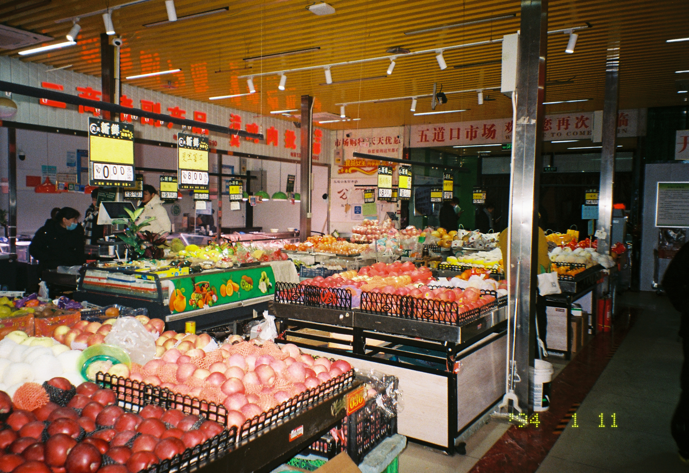
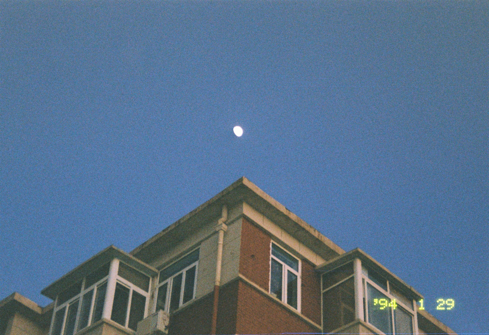

# XIONG — 数码与胶片

> 每一帧都是时间的显影。

[](https://daxiaxiong88.github.io/zhxiong/)
[](https://github.com/daxiaxiong88/zhxiong)

---

## 🖼️ 作品速览

<div align="center">

<!-- Hero 精选 -->
<a href="gallery/数码/nature-04.jpg">
  
</a>

<br/><br/>

**胶片 · Film** — 银盐在相纸上慢慢浮现

<table>
  <tr>
    <td><a href="gallery/胶片/film-01.jpg"></a><br/><sub>NO. 0042</sub></td>
    <td><a href="gallery/胶片/film-02.jpg"></a><br/><sub>NO. 0002</sub></td>
    <td><a href="gallery/胶片/film-03.jpg"></a><br/><sub>NO. 0003</sub></td>
  </tr>
  <tr>
    <td><a href="gallery/胶片/film-04.jpg"></a><br/><sub>NO. 0005</sub></td>
    <td><a href="gallery/胶片/film-05.jpg"></a><br/><sub>NO. 0012</sub></td>
    <td><a href="gallery/胶片/film-06.jpg"></a><br/><sub>NO. 0028</sub></td>
  </tr>
</table>

<br/>

**数码 · Digital** — 像素记录下每一个精确的瞬间

<table>
  <tr>
    <td><a href="gallery/数码/nature-01.jpg"></a><br/><sub>#01 · 风光</sub></td>
    <td><a href="gallery/数码/nature-02.jpg"></a><br/><sub>#02 · 风光</sub></td>
    <td><a href="gallery/数码/nature-03.jpg"></a><br/><sub>#03 · 风光</sub></td>
  </tr>
  <tr>
    <td><a href="gallery/数码/nature-04.jpg"></a><br/><sub>#04 · 风光</sub></td>
    <td><a href="gallery/数码/nature-05.jpg"></a><br/><sub>#05 · 风光</sub></td>
    <td><a href="gallery/数码/nature-06.jpg"></a><br/><sub>#06 · 风光</sub></td>
  </tr>
  <tr>
    <td><a href="gallery/数码/object-01.jpg"></a><br/><sub>#07 · 街拍</sub></td>
    <td><a href="gallery/数码/object-02.jpg"></a><br/><sub>#08 · 静物</sub></td>
    <td><a href="gallery/数码/people-01.jpg"></a><br/><sub>#13 · 人像</sub></td>
  </tr>
</table>

</div>

---

## 📂 项目结构

```
zhxiong/
├── index.html          # 主展示页（胶片 + 数码双分区）
├── admin.html          # 作品上传与管理后台
├── gallery/
│   ├── 胶片/           # 胶片摄影作品
│   ├── 数码/           # 数码摄影作品
│   └── images.json     # 照片元数据索引
└── README.md           # 本文件
```

## 🚀 在线访问

| 页面 | 链接 |
|------|------|
| **作品展示** | [daxiaxiong88.github.io/zhxiong](https://daxiaxiong88.github.io/zhxiong/) |
| **上传管理** | [daxiaxiong88.github.io/zhxiong/admin.html](https://daxiaxiong88.github.io/zhxiong/admin.html) |

## 🛠️ 技术要点

- **纯静态**：单文件 HTML，无构建依赖，直接部署 GitHub Pages
- **响应式**：手机 / 平板 / 桌面自适应布局
- **交互**：胶片横向拖拽滚动 + 数码网格瀑布流 + 全屏 Lightbox
- **后台**：通过 GitHub API 直接上传、删除作品，自动更新索引

---

<div align="center">
  <sub>XIONG PHOTOGRAPHY / 胶片 ● & 数码 ●</sub>
</div>
